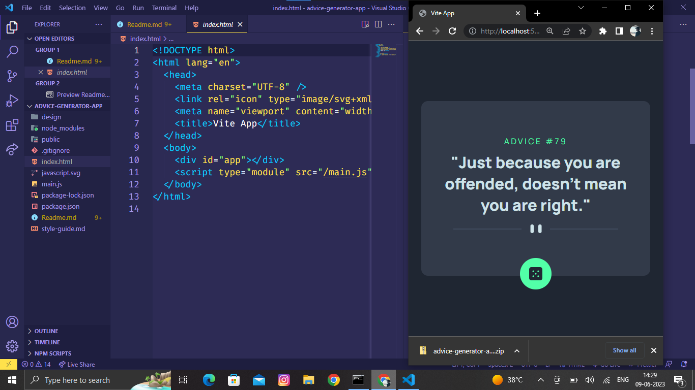

# Advice Generator App

This is a solution to the "Advice Slip Generator" challenge from Frontend Mentor. It is a web application that generates random pieces of advice to help users get inspired, motivated, or simply amused.

## Table of Contents

- [Overview](#overview)
  - [The Challenge](#the-challenge)
  - [Live Demo](#live-demo)
  - [Screenshot](#screenshot)
- [Features](#features)
- [Technologies Used](#technologies-used)
- [Getting Started](#getting-started)
  - [Installation](#installation)
  - [Running the App](#running-the-app)
- [Contributing](#contributing)
- [License](#license)
- [Acknowledgements](#acknowledgements)

## Overview

### The Challenge

The challenge was to build a web application that generates random pieces of advice from the Advice Slip API. The application should be designed to display the advice and generate a new piece of advice when the user submits the form.

### Live Demo

Try the application live at .

### Screenshot



## Features

- Generates random pieces of advice.
- User-friendly design.
- Generates a new piece of advice when the user requests it.
- Fully responsive design that adapts to different screen sizes.

## Technologies Used

This app was built using the following technologies:

- HTML
- CSS
- JavaScript
- AJAX
- Vite.js

## Getting Started

To run this app locally, follow these instructions:

### Installation

1. Clone this repository using the following command:
   ```
   $ git clone https://github.com/[YOUR_USERNAME]/advice-generator-app.git
   ```
2. Change directory to the project directory:
   ```
   $ cd advice-generator-app
   ```
3. Install the required dependencies:
   ```
   $ npm install
   ```

### Running the App

To run the app, use the following command:
```
$ npm start
```

This will start the development server, and the app will be accessible at `http://localhost:8080/`.

## Acknowledgements

This app was built with the help of the following resources:

- [Advice Slip API](https://api.adviceslip.com/)
- [Vite.js](https://vitejs.dev/)
- [MDN Web Docs](https://developer.mozilla.org/en-US/)
